## 1주차

## 2주차
  - Github 사용법
  - 안드로이드앱 프로그래밍 시작
    - Toast 알림
    - AVD 시작하기

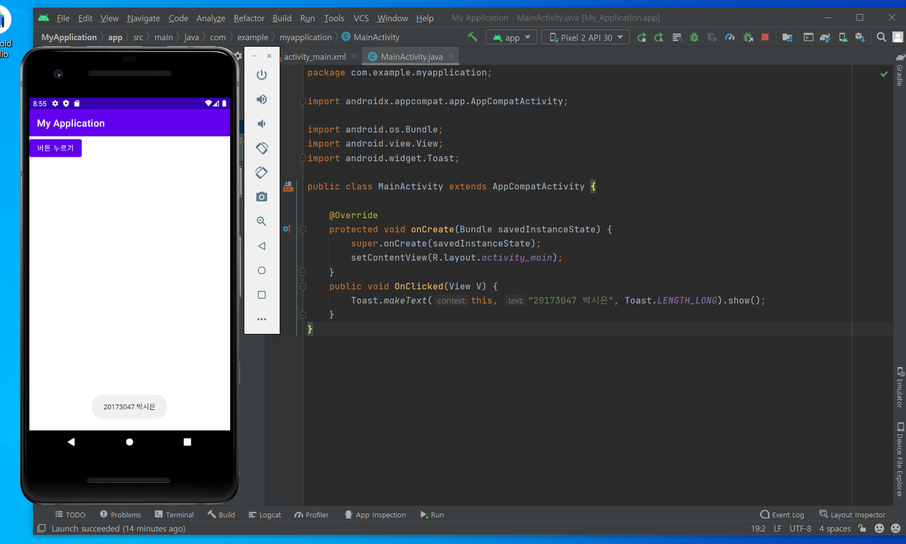</img>

## 3주차
  - 다른 사이트 들어가기
  - 전화번호 입력창 열기

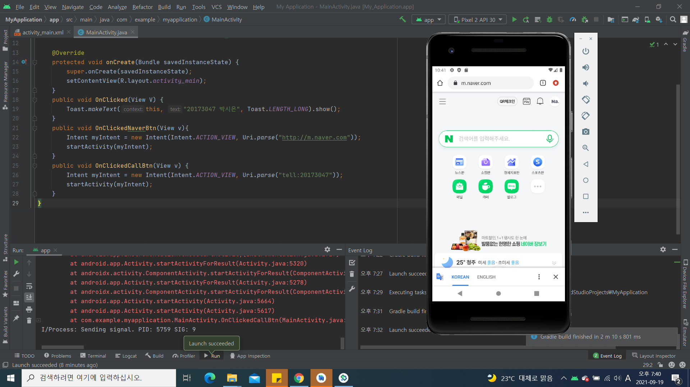</img>
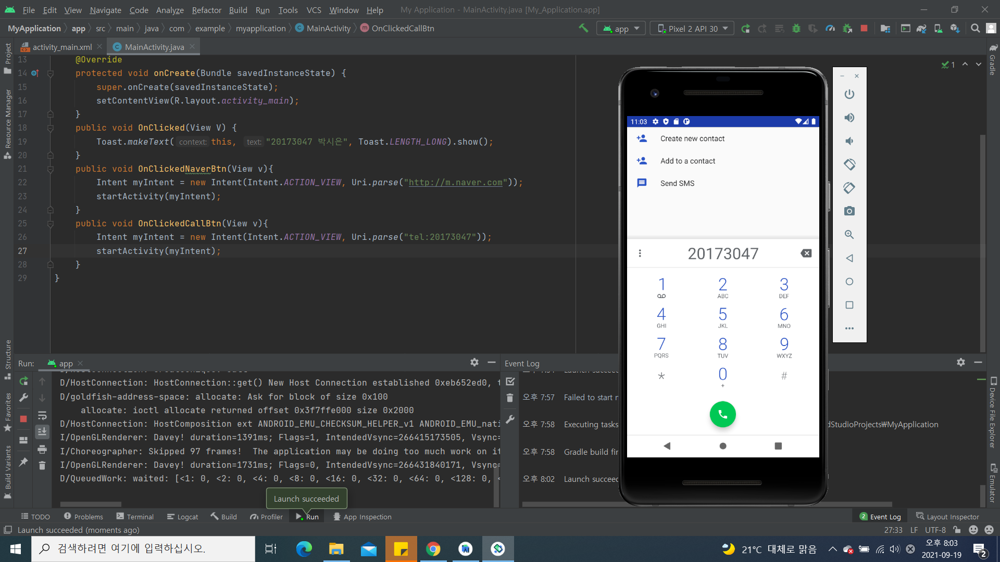</img>

## 4주차 과제

##### 앱 기획 아이디어 정리 : 천체 관측 앱 만들기

###### ◑ 만들고 싶은 앱 : 천체 관측 앱 - 컴퓨터에 설치가능한 앱만 있기 때문에, 휴대폰으로도 볼 수 있는 앱을 개발하고자 함.
###### - 도시에서는 어려운 천체 관측을 손 안에서 편리하게 할 수 있는 앱.
###### - 지도를 보는 것처럼 밤하늘도 자유롭게 볼 수 있는 앱. (밤하늘 지도를 만든다고 생각하면 좋을 것 같음)
###### - (시나리오) 첫 화면은 반드시 오늘의 밤하늘 전체 모습 (오늘의 달, 오늘의 별자리 포함)

###### ◑ 들어가야할 메뉴
###### - 날짜를 선택할 수 있는 칸. -> 원하는 날짜의 은하계를 관찰할 수 있음.
###### - 달의 실시간 모습 (달을 360도 돌려볼 수 있도록, 지구본처럼)
###### - 관측할 수 있는 별자리 (전체 밤하늘의 모습 -> 별자리를 선택하면 해당 별자리의 모습, 관측 가능 계절, 별자리에 담긴 이야기 등의 정보도 함께 제공)
###### - 은하계 행성들의 실시간 모습 
###### - 날씨 정보 제공 (밤하늘을 관측하기 좋은 날을 알려줌. ex. 오늘은 밤하늘을 관측하기 좋은 날 입니다.)
###### - 천체 관측에 관한 정보 제공 (망원경 추천, 장소 추천 등등)
###### - 오늘의 천문대 소개 (하루에 한곳 씩 전국에 있는 천문대들을 소개해주는 메뉴)

## 5주차
  - 이미지 바꾸기 버튼
  
  
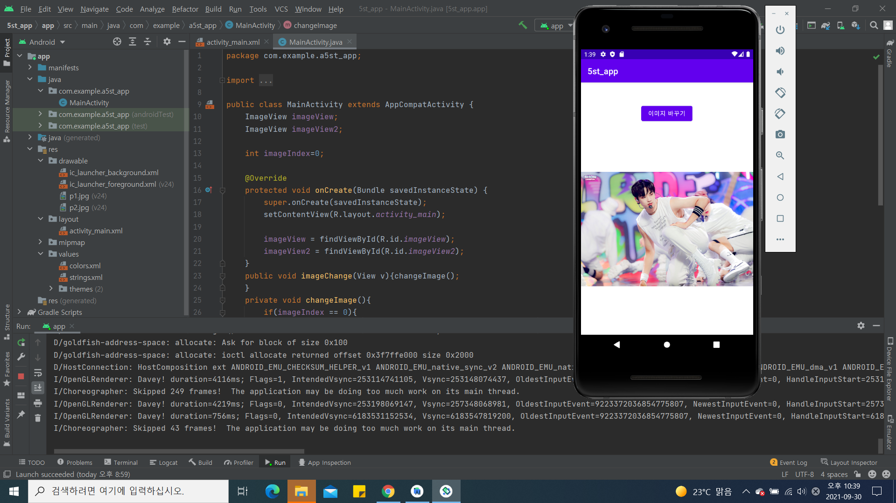</img>
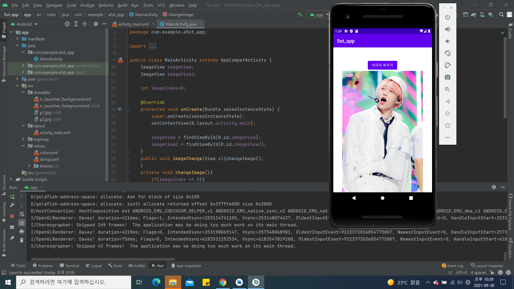</img>

## 6주차
  - 스크롤 바 만들기
  - 이미지의 넓이와 높이 Toast로 띄우기

</img>  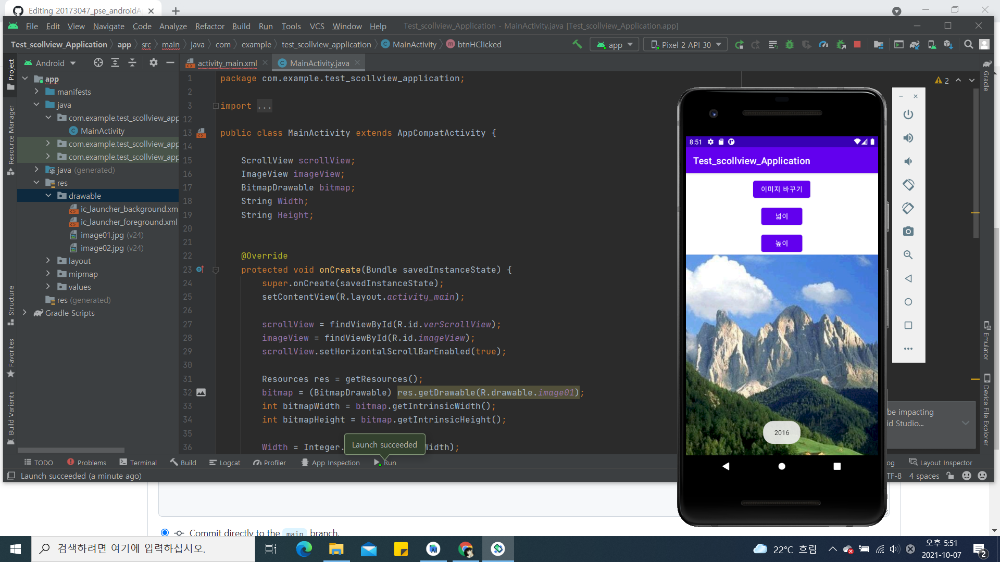</img>
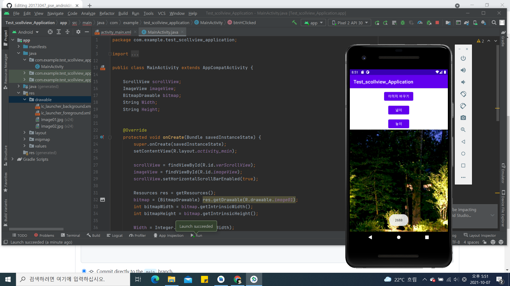</img>  </img>

## 7주차
  - 메세지 전송버튼, 닫기 버튼, 입력창

  - 글자를 입력했을 때 
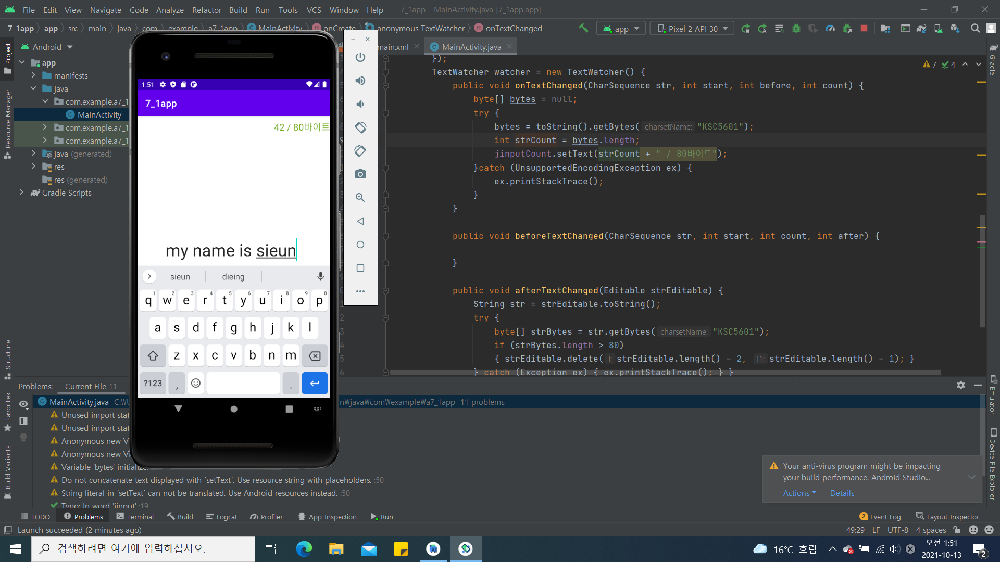</img>

  - 전송 버튼을 눌렀을 때 
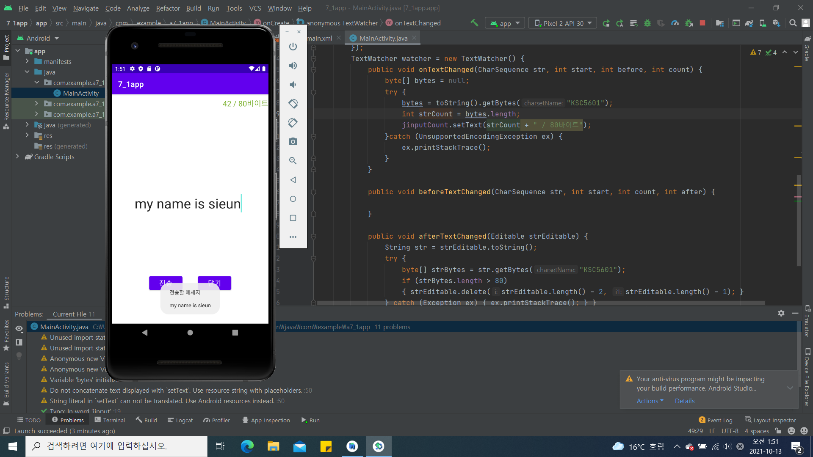</img>

  - 닫기 버튼을 눌렀을 때 
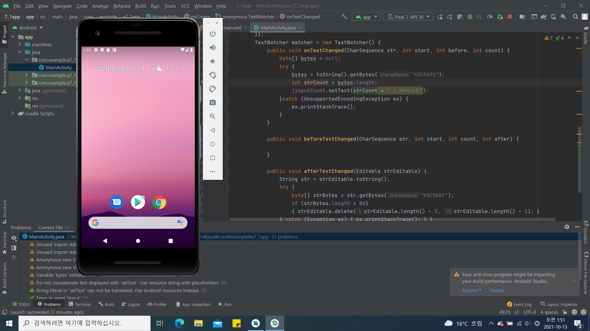</img>

## 9주차
  - 드로어블 만들기 
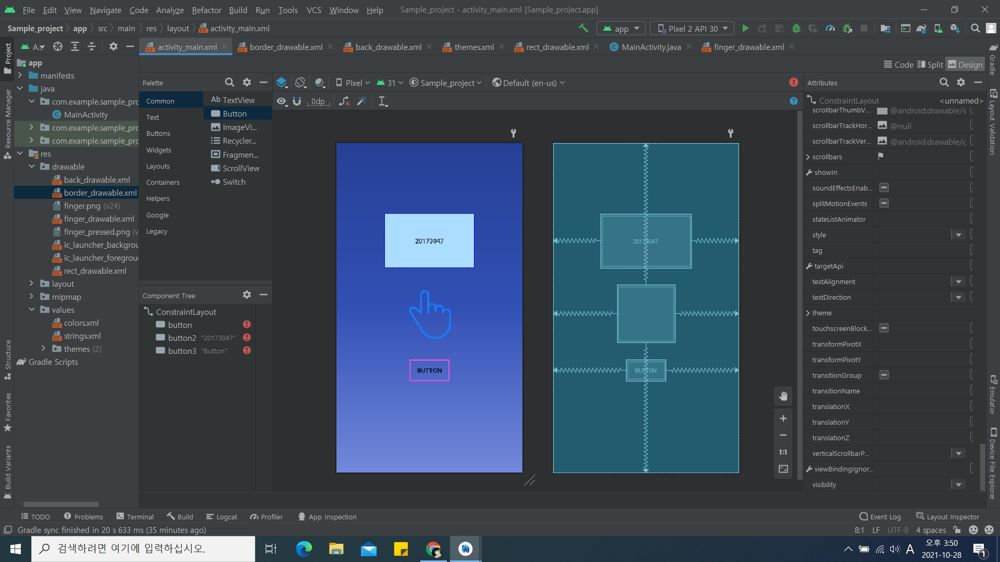</img>

## 10주차
  - 돌아가기 버튼, 화면 전환하기, Toast 메세지 띄우기 
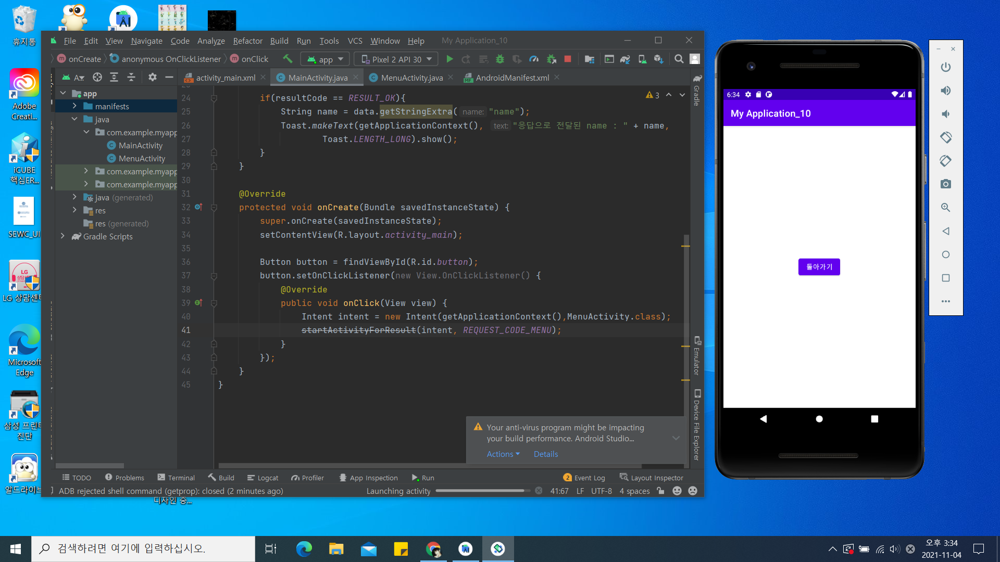</img>  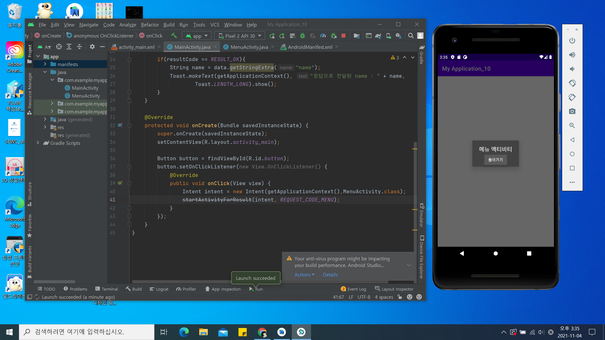</img>
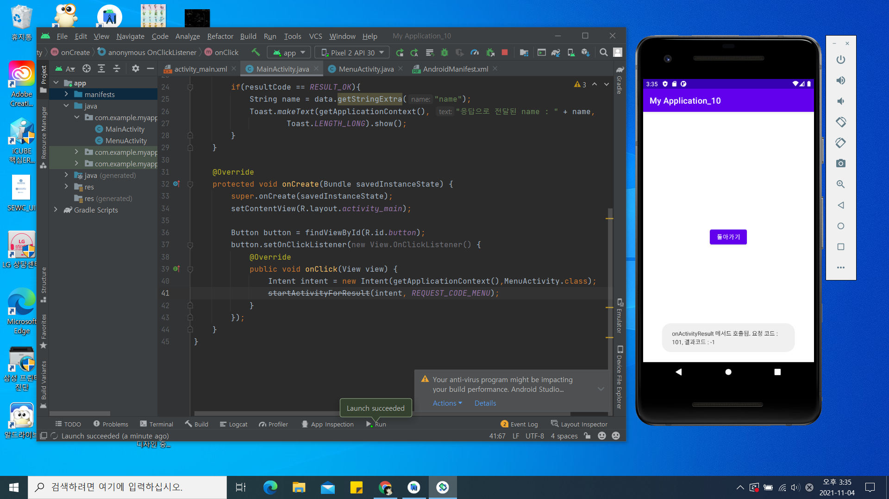</img>  </img>

## 11주차
  - 웹으로 요청하기 
</img>
</img>

